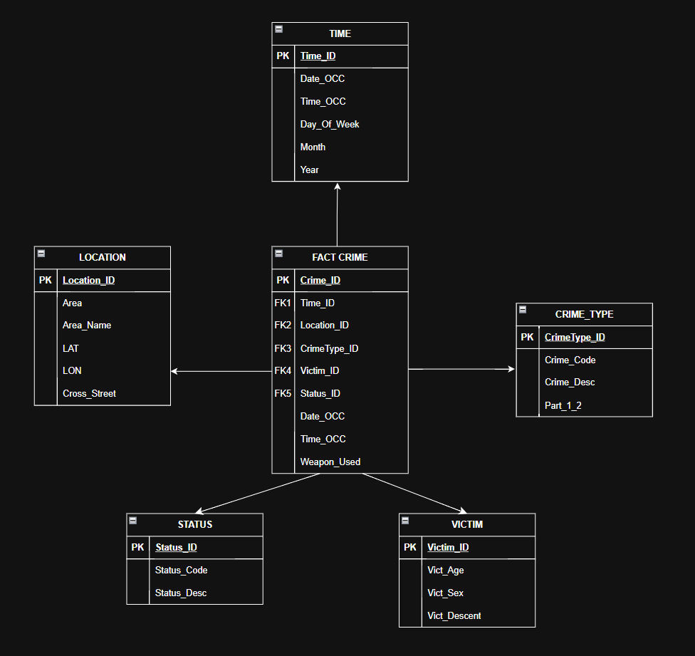
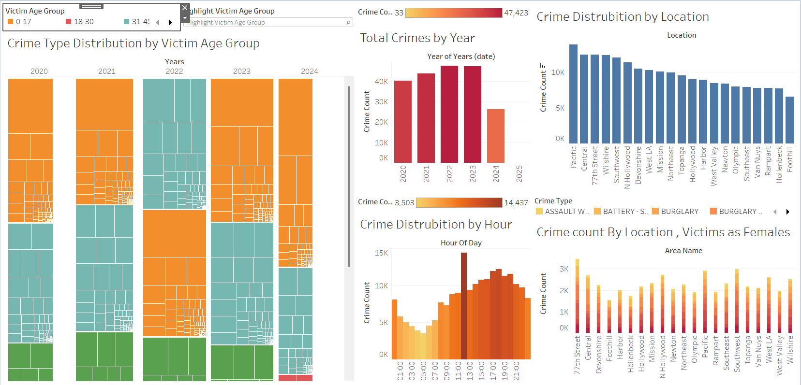

# LAPD Crime Data Warehouse & Visualization Project

## Overview

This project implements a data warehouse and visualization platform for analyzing LAPD crime data from 2020 to the present. The system extracts, transforms, and loads over 1 million records into a star schema, and presents insights via SSRS and Tableau dashboards.

---

## Business Vision

The project aims to support:

- **Law enforcement decision-making** by revealing crime trends and high-risk locations.
- **Operational staff** with geo-temporal analysis of crimes.
- **Community stakeholders** through accessible data visualizations to promote public safety awareness.

---

## Star Schema Design

The data warehouse is structured using a **Star Schema** with:

### Entity-Relationship Diagram (ERD)

- **Fact Table**: `Fact_Crime`
- **Dimension Tables**:
  - `Time_Dimension`
  - `Location_Dimension`
  - `CrimeType_Dimension`
  - `Victim_Dimension`
  - `Status_Dimension`

This schema allows for fast querying and clear separation of attributes like time, location, crime type, victim demographics, and status.

---

## ETL Implementation (SSIS)

ETL pipelines are developed using **SQL Server Integration Services (SSIS)**:

- **Time Dimension**: Derived columns from `DATE_OCC` to extract year, month, day, etc.
- **Location Dimension**: Unique locations extracted and sorted from raw data.
- **Crime Type Dimension**: Based on unique combinations of `Crm_Cd` and `Description`.
- **Victim Dimension**: Age, gender, and descent cleaned and deduplicated.
- **Status Dimension**: Case status and description parsed and formatted.

The final **Fact Table** is populated with cleaned and dimensionally mapped data using multiple lookup transformations.

---

## Sample Queries & Reports (SSRS)

1. **Crime Distribution by Location**  
Top Area: Pacific, with 13,793 reported crimes.

2. **Crime by Time of Day**  
Peak Time: 12:00 PM, with 14,437 crimes recorded.

3. **Crime Type by Female Victims and Area**  
Most common crime in 77th Street: Theft of Identity, reported 734 times.

4. **Crime Trends by Year and Victim Age Group**  
Most affected group: Ages 18–30  
Top crime type: Battery - Simple Assault

---

## Tableau Dashboards

Interactive dashboards include:

- **Treemaps**: Crime type distribution by age group and year.
- **Heatmaps**: Hourly and annual crime frequency.
- **Bar Charts**: Crime count by area.
- **Filter Controls**: Enable dynamic filtering by year, age group, crime type.

---

 ## Tableua Interactive Presentation

---

## Technical Stack

- **ETL**: SSIS (SQL Server Integration Services)
- **Database**: SQL Server 2019
- **Reporting**: SSRS (SQL Server Reporting Services)
- **Visualization**: Tableau Public
- **Data Source**: `Crime_Data_from_2020_to_Present.csv`

---

##Credits

- **Dataset**: [LAPD Open Data Portal](https://data.lacity.org/)

---

## License

This project is for academic use. Please credit if you reuse the structure or queries.
